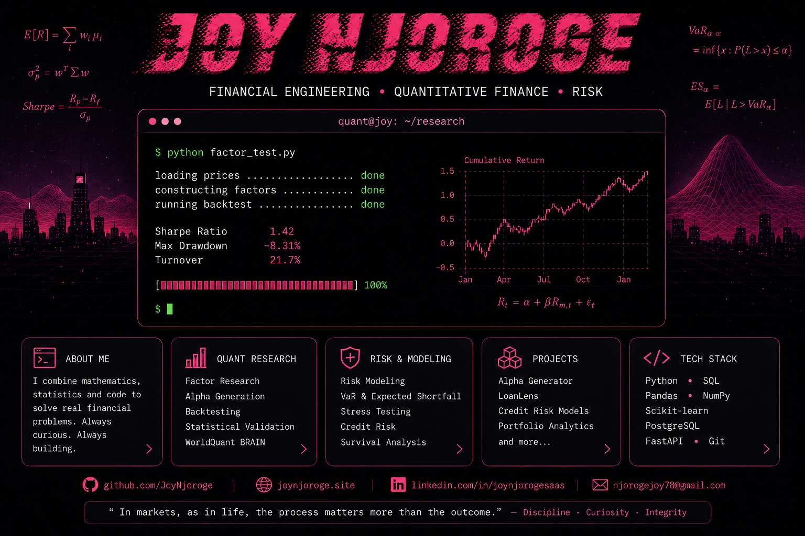

 

---

###  about me

I work at the intersection of **finance, mathematics, risk, and software**.

My background is in Actuarial Science and Software Engineering, and I’m currently pursuing a Master's in Financial Engineering. I’m interested in quantitative finance, financial modeling, risk, financial markets, and research that can survive contact with real data.

I like taking a financial question, turning it into something testable, and then building the thing that answers it.

---

###  quantitative research

My current research interests include:

- Factor investing and risk premia
- Alpha research and systematic strategies
- Portfolio construction and optimization
- Risk budgeting and risk parity
- Black–Litterman models
- Volatility and tail-risk modeling
- Backtesting and out-of-sample validation
- Quantitative approaches to digital-asset markets

---

###  risk & financial modeling

My actuarial background gives me a particular interest in quantitative risk.

I’m exploring:

- Probability of Default (PD)
- Loss Given Default (LGD)
- Exposure at Default (EAD)
- Expected Loss
- Survival analysis and time-to-default
- VaR and Expected Shortfall
- Stress testing
- Risk attribution
- Credit and portfolio modeling

---

###  selected work

**Alpha Generator**  
Quantitative research using WorldQuant BRAIN, with a focus on factor construction, alpha generation, and statistical evaluation.

**LoanLens**  
A lending-focused project exploring credit analysis, financial risk, and the interpretation of loan agreements.

More projects are being rebuilt around quantitative finance, risk, markets, and financial modeling.

---

###  tools

**Python** · **SQL** · **PostgreSQL** · **NumPy** · **Pandas** · **scikit-learn** · **Matplotlib**

**FastAPI** · **Flask** · **Docker** · **Git** · **Linux**

---

###  currently building

A smaller, deeper portfolio.

Less:

`random project → abandoned repo → new idea → repeat`

More:

`financial question → hypothesis → model → experiment → validation → explanation`

The goal is to build work that demonstrates **how I think**, not just how many technologies I can list.

---

###  background

**MSc Financial Engineering** ➔ WorldQuant University  
**BSc Actuarial Science** ➔ Mount Kenya University  
**Software Engineering** ➔ Moringa School

---

### Financial Engineering · Quantitative Finance · Risk

*Mathematics · Statistics · Computation*

 

<a href="https://www.joynjoroge.site">Portfolio</a>
&nbsp; · &nbsp;
<a href="https://www.linkedin.com/in/joynjorogesaas">LinkedIn</a>
&nbsp; · &nbsp;
<a href="https://orcid.orgh/0009-0004-7644-6110/">ORCID</a>

---

